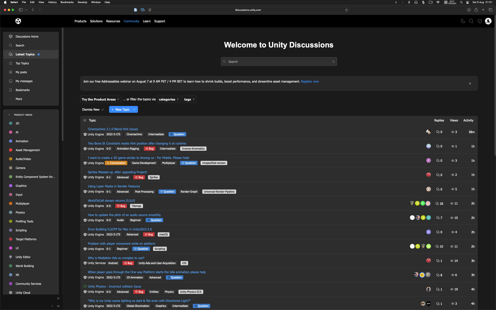

# Unity Discussions Custom Styler

A browser extension that applies beautiful custom styling overrides to the Unity Discussions website (https://discussions.unity.com).

## Features

🎨 **Custom Dark Theme** - Modern dark theme
🎯 **Enhanced UI Elements** - Improved buttons, forms, and navigation  

## Installation

### Chrome/Edge/Brave (Chromium-based browsers)

1. **Download the Extension**
   - Clone or download this repository to your computer
   - Extract the files to a folder (e.g., `Unity Website`)

2. **Enable Developer Mode**
   - Open Chrome and go to `chrome://extensions/`
   - Toggle "Developer mode" in the top-right corner

3. **Load the Extension**
   - Click "Load unpacked"
   - Select the folder containing the extension files
   - The extension should now appear in your extensions list

4. **Pin the Extension** (Optional)
   - Click the puzzle piece icon in the toolbar
   - Find "Unity Discussions Custom Styles" and pin it

### Firefox

1. **Download the Extension**
   - Clone or download this repository

2. **Load Temporarily**
   - Go to `about:debugging#/runtime/this-firefox`
   - Click "Load Temporary Add-on"
   - Select the `manifest.json` file

*Note: For permanent installation in Firefox, the extension would need to be signed by Mozilla.*

## Usage

1. **Navigate to Unity Discussions**
   - Go to https://discussions.unity.com
   - The custom styles will automatically apply

## Screenshots

Here are some examples of the enhanced Unity Discussions experience:

*Enhanced dark theme with improved navigation and styling*

*Custom tag colors and improved topic list layout*

*Refined user interface elements and better readability*

*Improved notification panels and quick access menus*

*Enhanced post layout with better typography and spacing*

## Development

### Making Changes
1. Edit the CSS in `styles.css` for styling changes
2. Modify `content.js` for JavaScript functionality
3. Update `popup.html` and `popup.js` for settings interface

### Testing Changes
1. Make your changes to the files
2. Go to `chrome://extensions/`
3. Click the refresh button on the extension card
4. Refresh the Unity Discussions page

## Contributing

Feel free to submit issues and enhancement requests! If you'd like to contribute:

1. Fork the repository
2. Create a feature branch
3. Make your changes
4. Test thoroughly
5. Submit a pull request

## License

This project is open source and available under the [MIT License](LICENSE).

## Disclaimer

This extension is not officially affiliated with Unity Technologies. It's a community-created tool to enhance the user experience of the Unity Discussions website.

---

**Enjoy your enhanced Unity Discussions experience!** 🎉

If you find this useful, consider sharing it with other Unity developers who might benefit from a better browsing experience.
